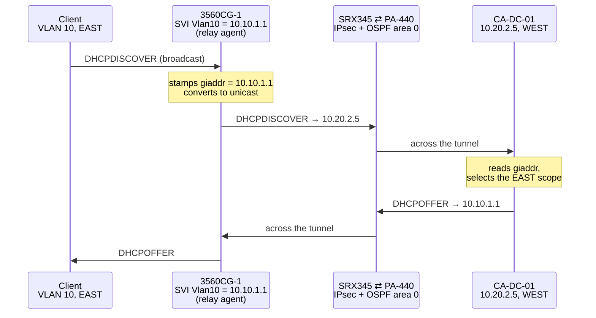

# Domain Services — AD DS, DNS, and Cross-Site DHCP

> **Part of [CASEY-LAB](https://github.com/117caseyallen-NetAdm/casey-lab)** — a
> dual-site, multi-vendor enterprise homelab. Start at the
> [hub](https://github.com/117caseyallen-NetAdm/casey-lab) for the full topology,
> or the [profile](https://github.com/117caseyallen-NetAdm) for everything.
>
> **This documentation is living.** The lab keeps growing around this build —
> since it shipped, the DC became the NTP authority for every network device,
> and a config-backup service now watches the fabric. A second domain
> controller, TACACS+, 802.1X, and PKI are next. The commit history is the
> changelog.

Active Directory Domain Services, AD-integrated DNS, and centralized DHCP for a
**dual-site lab joined by a site-to-site IPsec tunnel**. The build detail that
matters: **one DHCP server addresses a subnet it has no interface on, at a
different site, across OSPF and an encrypted tunnel.**

Domain: `casey.corp` · Forest/domain functional level: Server 2016

## What this demonstrates

| Capability | How |
|---|---|
| **DHCP relay across a routed, tunneled fabric** | Clients at EAST get addresses from a server at WEST via `ip helper-address` and the `giaddr` field — no DHCP server on their subnet, no server interface on their VLAN |
| **AD-integrated DNS, both directions** | Forward zone plus **reverse lookup zones for all five subnets**, so logs show names |
| **Cross-site domain membership** | A client at EAST joins and authenticates to a DC at WEST over IPsec, locating it via `_msdcs` SRV records |
| **Time as infrastructure** | PDC emulator follows four external stepping sources; every domain member inherits it automatically, and **five of the six network devices sync to it explicitly**, set to UTC. The sixth — a PA-440 sourcing service traffic from an uncabled MGT port — is documented rather than hidden. [Verified output](https://github.com/117caseyallen-NetAdm/casey-lab/blob/main/docs/verification.md#6-one-time-hierarchy-across-the-fabric) |
| **Deliberate service placement** | DNS installed *by* promotion (AD-integrated from the start), DHCP added separately so each layer could be verified independently |

## The part worth reading: DHCP across the tunnel

A DHCP client broadcasts. Broadcasts don't cross routers. So how does a machine
at EAST get an address from a server at WEST, four routed hops and an IPsec
tunnel away?

**The mechanism is `giaddr`.** The relay agent stamps its own interface address
into the DHCP header's gateway field. The server reads that field and uses it to
**choose which scope to serve from** — that single field is how one server
addresses subnets it isn't attached to.

Two consequences that make this fail if you miss them:

1. **The server needs a route back to the relay** (`10.10.1.1`), not to the
   client. Here that's OSPF across the IPsec tunnel.
2. **A scope matching the `giaddr` subnet must exist**, or the server silently
   ignores the request — no error, no log entry worth finding.

"DHCP doesn't work at the far site" is almost always one of those two, not a
broken relay.

Config: [`configs/3560cg-1-dhcp-relay.txt`](configs/3560cg-1-dhcp-relay.txt) ·
[`configs/dhcp-scopes.ps1`](configs/dhcp-scopes.ps1)

## Design decisions

| Decision | Choice | Reason |
|---|---|---|
| DNS installation | Installed **by** dcpromo, not beforehand | Promotion creates the zone **AD-integrated** from the start. Pre-installing the standalone DNS role means promotion has to work around a file-backed server |
| DHCP timing | Added **after** promotion, as its own step | DHCP must be **authorized in AD**, which requires the domain to exist. Also keeps each layer independently verifiable |
| Reverse zones | All five subnets | Skipped by most homelabs. Makes `nslookup 10.99.10.14` return a name — invaluable once firewall and SIEM logs are involved |
| Static vs reservation | **DHCP reservations** for endpoints | Address assignment lives in one queryable place instead of typed into machines you'd have to log into to discover. Only infrastructure that must work *when DHCP is down* stays truly static |
| Time source | External NTP on the PDC emulator only | Domain members follow the domain hierarchy automatically. The PDC emulator is the only machine needing manual config — it sits at the top with nothing above it |
| Client DNS | **DC only**, never a public resolver as secondary | See the trap below |

## The DNS trap

A domain member must point **only** at the domain controller for DNS.

Add `1.1.1.1` as a secondary resolver and Windows will sometimes ask *it* for
`casey.corp` records. It answers NXDOMAIN, because `.corp` is not a delegated
TLD and no public resolver can find your zone. The result is intermittent logon
failures, GPOs not applying, and "domain not available" errors that vanish on
retry and resist diagnosis.

**Correct design: clients → DC only. DC → forwarders → public resolver.**
Internet resolution still works; it just goes *through* the DC.

## Contents

- **[docs/build-notes.md](docs/build-notes.md)** — the build in the order it
  happened, with the verification step at each stage and the reasoning behind
  the ordering
- **[docs/troubleshooting.md](docs/troubleshooting.md)** — what went wrong: a GUI
  wizard reporting "installation failed" while hiding *which* component failed, a
  domain controller that came within one command of being permanently named
  `WIN-EL9MD23QN91`, and how to read a `dcdiag` that fails on every healthy
  freshly-promoted DC because it is a log scraper rather than a health check
- **[configs/](configs/)** — DNS, DHCP, and time configuration, plus the IOS
  relay config

---

*Internal RFC1918 addressing and hostnames are real. No credentials, keys, public
addresses, or device configurations appear in this repository.*
